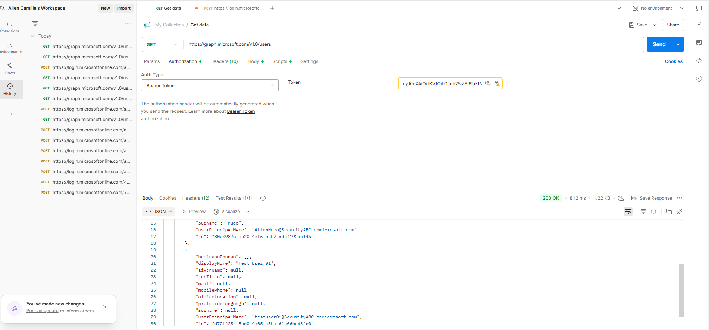

# SC300 Microsoft Graph Lab

## Sammanfattning
Denna labb visar steg för att konfigurera en Azure AD app med rätt API-behörigheter för Microsoft Graph, 
skapa token och göra anrop mot Microsoft Graph API med Postman.

## Steg i labben

1. Skapa en app-registrering i Azure AD.
2. Lägg till API-behörigheter, både delegat och program (t.ex. User.Read, User.Read.All).
3. Bevilja administratörsgodkännande för organisationen för programbehörigheter.
4. Skapa en klienthemlighet under "Certificates & secrets".
5. Använd Postman för att skapa en token via OAuth 2.0 klientuppgifter (client_credentials).
6. Testa att anropa Microsoft Graph API, t.ex. https://graph.microsoft.com/v1.0/users.
7. Felsök vanliga fel som behörighetsproblem och ogiltiga URL:er.
8. Bekräfta att anropet fungerar och få JSON med användardata.

## Viktiga lärdomar
- Skillnad mellan delegat- och programbehörigheter.
- Hur man beviljar administratörsgodkännande.
- Användning av Postman för API-tester med OAuth 2.0.
- Vanliga fel och hur man löser dem.

## Mappstruktur
- screenshots/: innehåller alla skärmbilder från labben.
- README.md: denna sammanfattning.

# SC-300 Microsoft Graph API Lab

Denna laboration visar hur man registrerar en app i Azure, ger rätt API-behörigheter och testar anrop mot Microsoft Graph API med Postman.

---

## Screenshots och beskrivningar

## Screenshots och beskrivningar

### Bild 1: Postman – GET-anrop mot Microsoft Graph API för att hämta användare med giltig Bearer-token
  
Visar API-förfrågan och JSON-svar med användardata.

---

### Bild 2: Azure Portal – App-registreringens API-behörigheter
  
Här listas tillagda delegerade API-behörigheter för appen, User.Read visas som ej administratörsgodkänd.

---

### Bild 3: Azure Portal – Välj typ av API-behörigheter för applikationen
  
Val mellan delegerade behörigheter (användarnamn) och programbehörigheter (applikationsnamn).

---

### Bild 4: Azure Portal – Lista över möjliga delegerade behörigheter under Microsoft Graph API
  
Här väljs specifika behörigheter, t.ex. User.Read.All för full läsbehörighet på användarprofiler.

---

### Bild 5: Azure Portal – Administratörsgodkännande krävs för vissa API-behörigheter
  
Bekräftelse på att User.Read.All kräver administratörsmedgivande för att aktiveras.

---

### Bild 6: Azure Portal – Appens API-behörigheter efter administratörsgodkännande
  
User.Read och User.Read.All är nu godkända och aktiva.

---

### Bild 7: Postman – POST-anrop för att hämta access token via client credentials grant
  
Visar hur client_id, client_secret, scope och grant_type skickas i kroppen för att få token.

---

### Bild 8: Postman – Lyckat GET-anrop med token mot Microsoft Graph API
  
JSON-svar med flera användare bekräftar att behörigheterna fungerar korrekt.

---

### Bild 9: Azure Portal – Välj mellan delegerade och programbehörigheter
  
Här visas valet mellan delegerade (inloggad användare) och programbehörigheter (tjänst utan inloggning).

---

### Bild 10: Azure Portal – Endast User.Read har lagts till
  
Illustrerar att bara `User.Read` har lagts till som delegerad behörighet, utan administratörsgodkännande.

# Sammanfattning

I denna labb skapade vi en app i Azure, lade till och administratörsgodkände API-behörigheter för Microsoft Graph, hämtade token via klientuppgifter och testade API-anrop i Postman.  
Det visade hur man arbetar med OAuth 2.0 client credentials flow och Microsoft Graph API.
