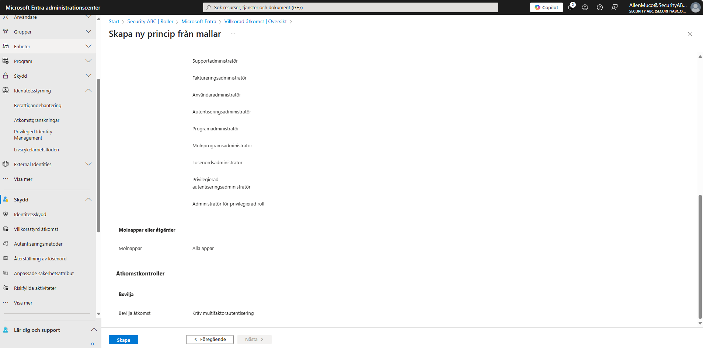
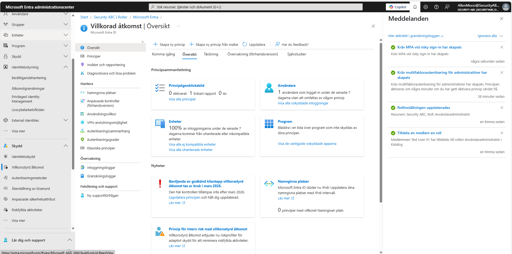
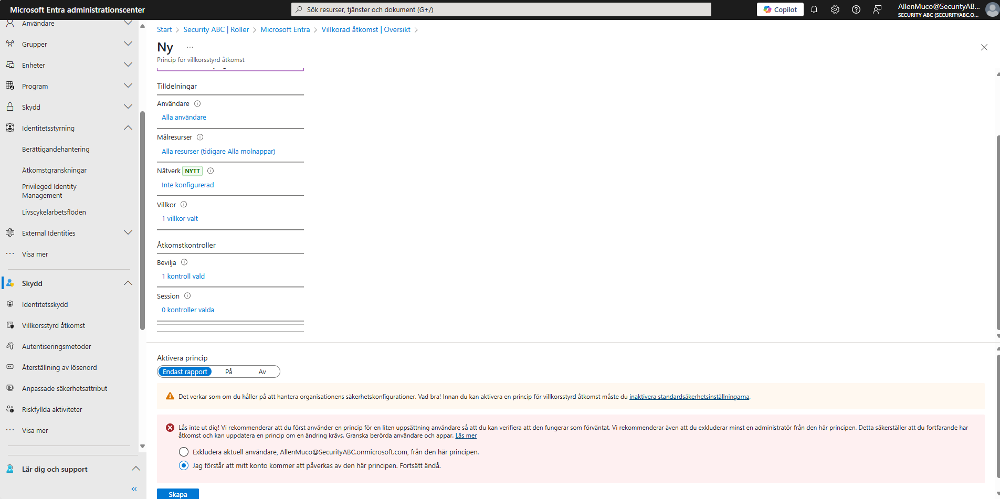
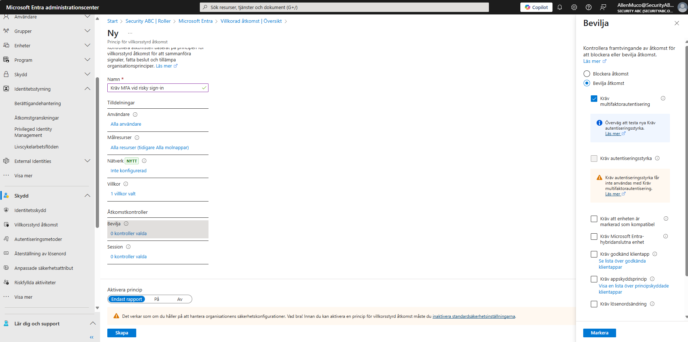
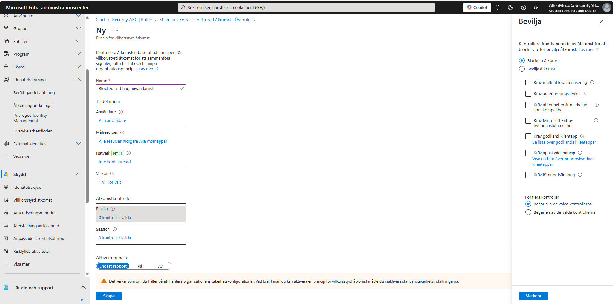

# SC-300 Week 3 – Conditional Access & MFA

## Sammanfattning

I denna vecka konfigurerades **Conditional Access-policys** i Microsoft Entra ID för att förstärka säkerheten vid inloggningar. Fokus låg på att kräva **Multifaktorautentisering (MFA)** vid riskfyllda sign-ins, och att använda **rapportläge** för att testa utan påverkan på användarna.

## Delmoment

1. Skapa policy som kräver MFA för administratörsroller.
2. Ange villkor: riskfylld inloggning (user risk).
3. Aktivera rapportläge och analysera sign-ins.
4. Skapa policy för appar som kräver MFA.
5. Reflektera kring säkerhetsvinster och användarpåverkan.

---

## Screenshots och beskrivningar

### Bild 1 – Mall för MFA-policy för administratörer

### Bild 2 – Sammanfattning: Policy för risky sign-in

### Bild 3 – Sammanfattning: Roller och appar

### Bild 4 – Principöversikt och meddelanden om skapade policies

### Bild 5 – Bevilja MFA i princip (rapportläge)

### Bild 6 – Ej konfigurerat nätverk och aktivering i rapportläge

### Bild 7 – Princip från mallar med valda roller och appar

### Bild 8 – Bekräftelse av påverkan vid policyaktivering

### Bild 9 – Blockera åtkomst vid hög användarrisk

---

## 📘 Läs direkt i GitHub

- [SC300_Vecka3_Teori.md](./SC300_Vecka3_Teori.md) – Teori och bakgrund
- [SC300_Vecka3_Labb.md](./SC300_Vecka3_Labb.md) – Del 1: Skapa policy med MFA
- [SC300_Vecka3_Labb_Del2.md](./SC300_Vecka3_Labb_Del2.md) – Del 2: Risk-based Conditional Access
- [SC300_Vecka3_Labb_Del3.md](./SC300_Vecka3_Labb_Del3.md) – Del 3: App-specifik policy

---

## Viktiga lärdomar

- Rapportläge möjliggör säker testning av policys innan full tillämpning.
- Riskbaserade CA-policys ökar säkerheten utan att störa alla användare.
- Policytilldelning kan ske baserat på roller, appar och risknivåer.
