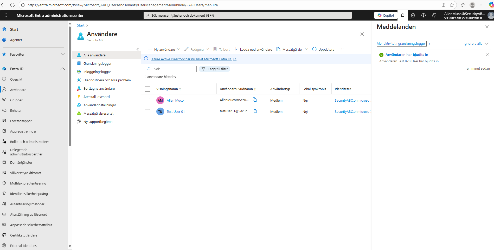
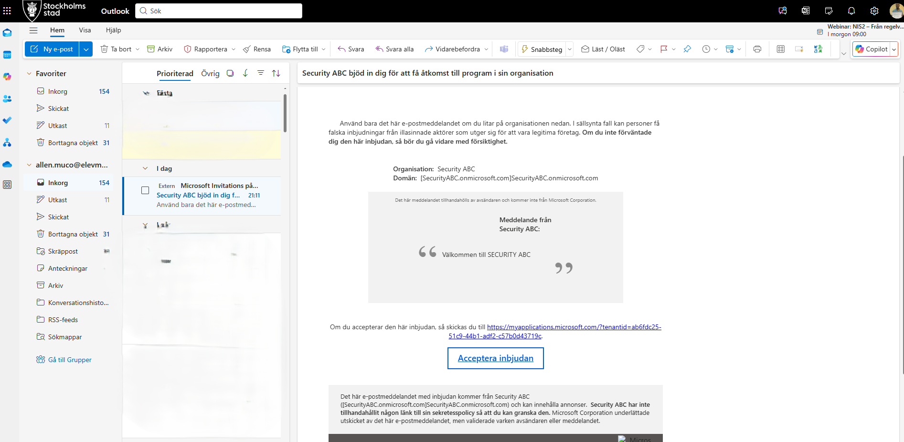
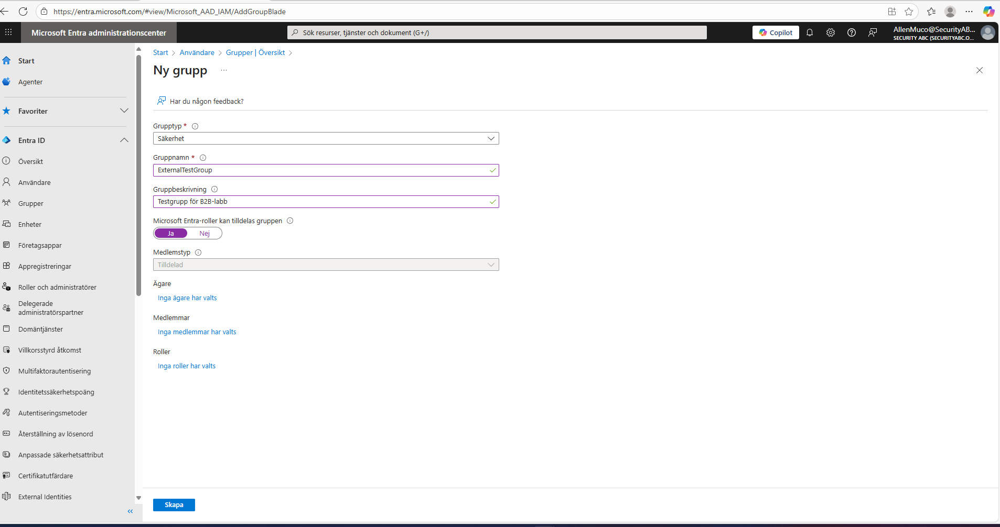
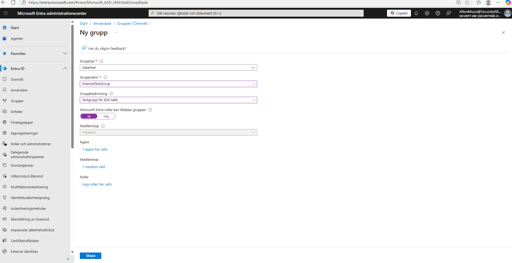
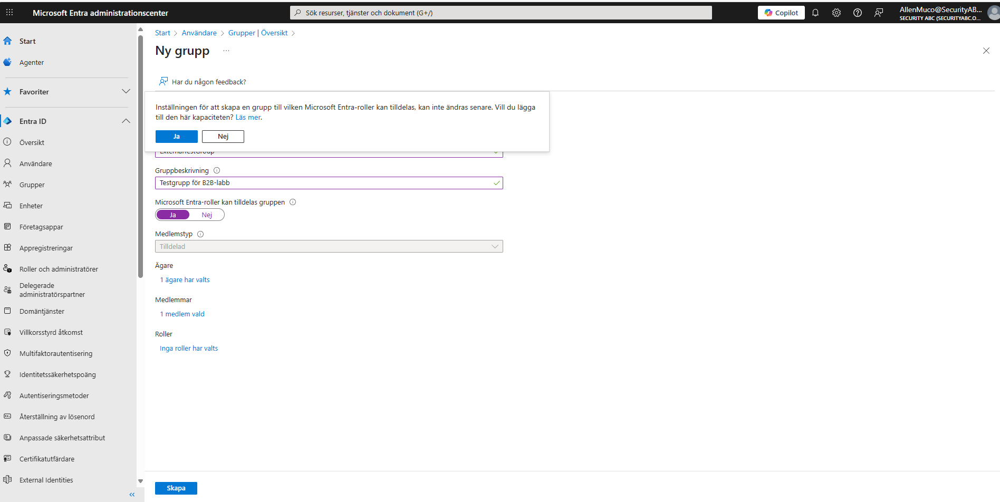
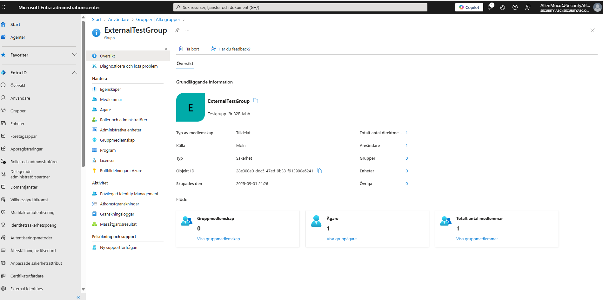
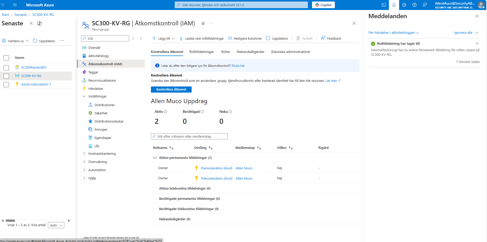

# Week 5 – External Identities (B2B & Federation)

## 🎯 Syfte
I denna labb undersöktes hur man arbetar med **External Identities (B2B)** i Microsoft Entra ID. Fokus låg på att bjuda in externa användare, verifiera deras åtkomst, samt hantera grupper och rolltilldelningar.

---

## 📑 Steg 1 – Bjud in extern användare
En ny B2B-användare bjuds in via **Entra ID → Users → New guest user**.

---

## 📑 Steg 2 – Gästanvändare skapad
Efter inbjudan syns gästanvändaren i användarlistan.

---

## 📑 Steg 3 – Inbjudningsmejl
Den externa användaren får ett mejl med länk för att acceptera inbjudan.

---

## 📑 Steg 4 – Skapa grupp för B2B
En ny säkerhetsgrupp skapas för att organisera externa användare.

### Fält ifyllda:

### Ägare och medlem vald:

### Bekräftelse vid skapande:

### Gruppens översikt (extra kontext):

---

## 📑 Steg 5 – Verifiering
Gruppen tilldelas en roll (Reader) på resursgruppen i Azure. Detta bekräftar att B2B-användaren nu har åtkomst via gruppen.

---

## ✅ Slutsats
- Externa användare kan bjudas in och verifieras via B2B-inbjudan.  
- Gästanvändare hanteras smidigt via grupper för åtkomstkontroll.  
- Rolltilldelningar fungerar även för externa identiteter.  

Denna labb visar på hur **External Identities** kan användas för att på ett säkert sätt samarbeta med externa parter.
