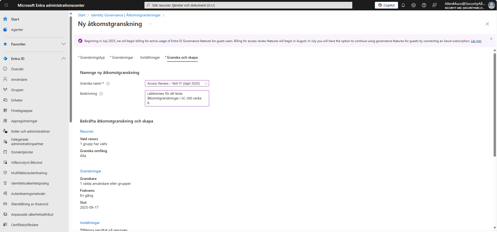
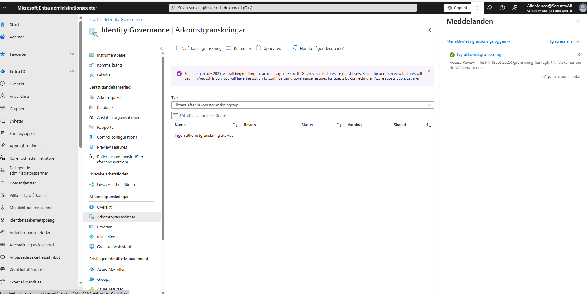
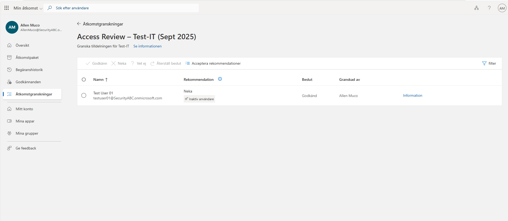
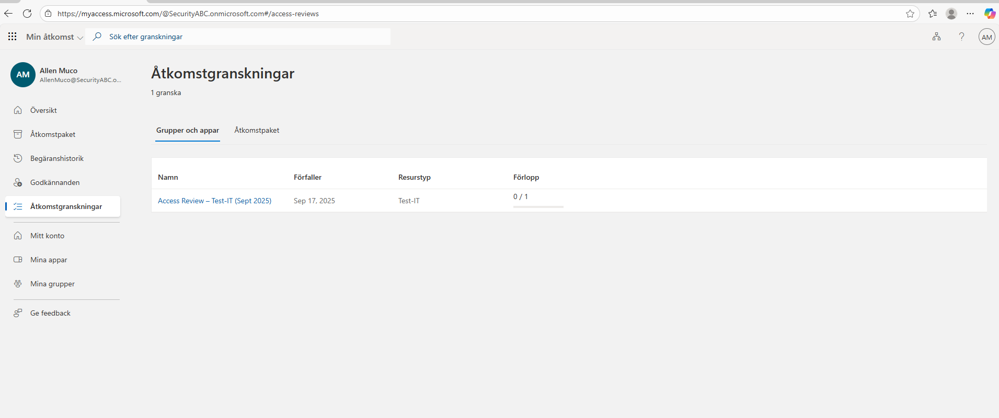
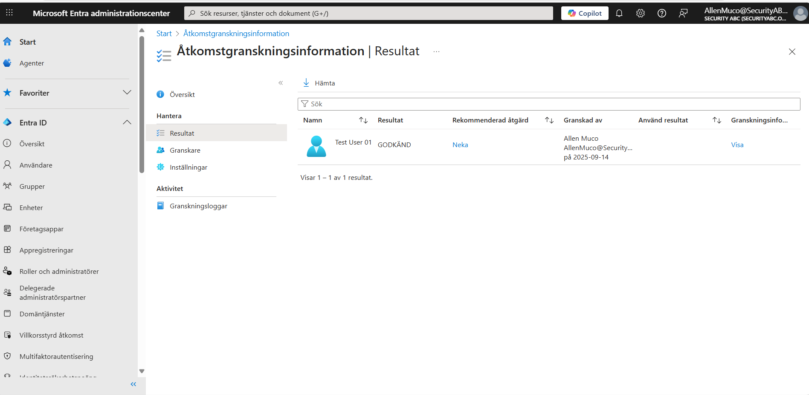

# Entra ID – Åtkomstgranskningar (kompakt)

Nedan följer sex skärmbilder som täcker den viktigaste resan: konfigurera, skapa, besluta och verifiera en åtkomstgranskning.

1. **Inställningar** – tidslinje, påminnelser och beslutshjälp  
   

2. **Om granskare inte svarar** – fallback-åtgärd (t.ex. *Ta bort åtkomst*)  
   

3. **Bekräfta & Skapa** – sammanfattning innan skapande  
   

4. **Beslutsvy i My Access** – granska och fatta beslut  
   

5. **Resultat uppdaterad** – beslut loggat och klart  
   

6. **Admincenter – Resultat** – verifiera i Entra admin att beslutet slog igenom  
   

---

### Slutsats  
I denna kompakta övning visades hela processen för en åtkomstgranskning i Entra ID: från konfiguration och automatiska regler för uteblivet svar, till beslut i My Access och verifiering i Admincenter.  
Detta illustrerar hur Access Reviews kan användas för att säkerställa korrekt behörighet över tid, vilket stärker både säkerheten och regelefterlevnaden.  

---

*Auto-genererad README. Antal kopierade bilder: 6.*
