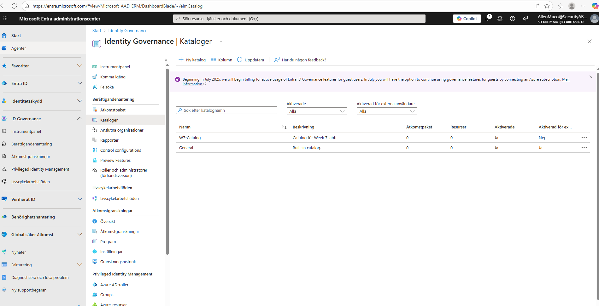
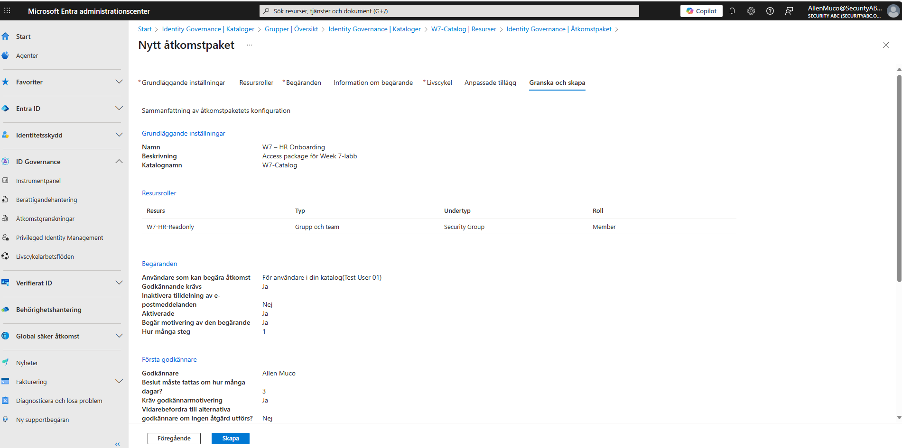
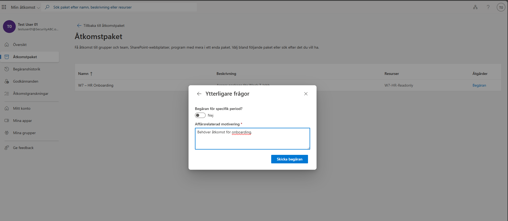
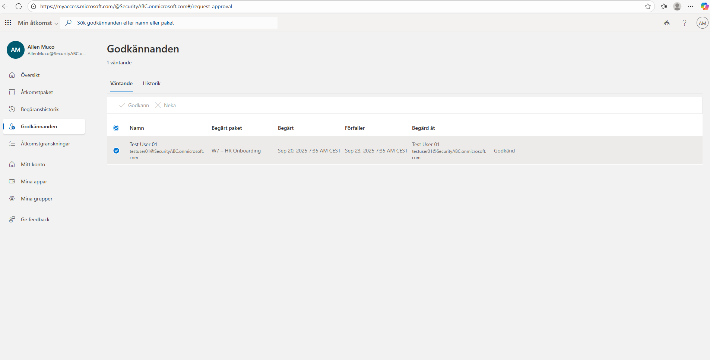
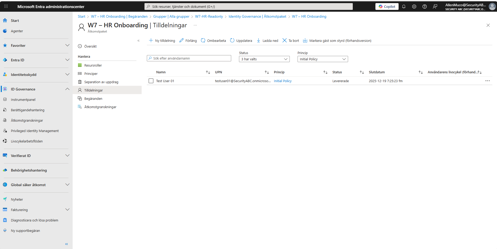
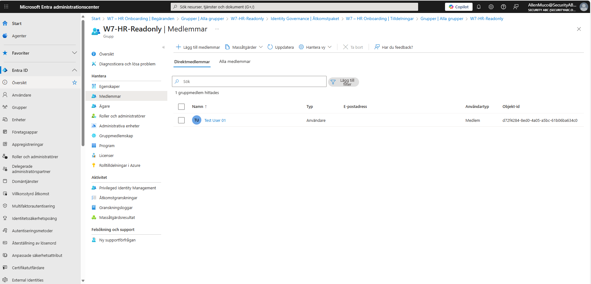

# Week 7 – Access Packages (Onboarding)

Detta labb demonstrerar hur man kan använda **Microsoft Entra ID Governance** för att automatisera onboarding-processer via **Access Packages**.  
Exemplet bygger på ett scenario där en nyanställd behöver åtkomst till en HR-grupp genom en styrd och spårbar process.

---

## 🎯 Syfte
- Förstå grunderna i **Identity Governance** och Access Packages.  
- Skapa ett accesspaket kopplat till en katalog.  
- Konfigurera godkännandeprocesser och verifiera att tilldelningen fungerar.  

---

## 📝 Teori
Access Packages i Entra ID gör det möjligt att:  
- Samla resurser (grupper, appar, roller) i ett paket.  
- Ställa in policies för **vem som kan begära åtkomst**, **godkännandesteg**, och **livscykel**.  
- Automatisera onboarding/offboarding med spårbarhet och compliance i fokus.  

➡️ Viktiga delar:  
- **Catalog** – en behållare för resurser och policies.  
- **Access Package** – själva paketet med resurser och regler.  
- **Approval Workflow** – styr vem som måste godkänna innan åtkomst beviljas.  
- **Assignment** – när en användare tilldelas resurser efter godkännande.  

---

## 🛠️ Labbsteg

### 1️⃣ Skapa katalog
Skapa en katalog **W7-Catalog** och lägg till resursen **W7-HR-Readonly**.

---

### 2️⃣ Skapa accesspaket
Skapa accesspaketet **W7 – HR Onboarding** och koppla resursen samt konfigurera policyn.

---

### 3️⃣ Användaren skickar in begäran
**Test User 01** begär åtkomst via *My Access Portal* och anger motivering.

---

### 4️⃣ Godkänn begäran
Begäran hanteras av godkännare (**Allen Muco**) i *My Access Portal*.

---

### 5️⃣ Tilldelning
Efter godkännande visas tilldelningen som **Levererade** i Entra admin.

---

### 6️⃣ Verifiera gruppmedlemskap
Slutligen verifieras att **Test User 01** är medlem i gruppen **W7-HR-Readonly**.

---

## ✅ Resultat
- Ett accesspaket har skapats och kopplats till en katalog.  
- Begäran om åtkomst har hanterats via ett godkännande-flöde.  
- **Test User 01** har automatiskt lagts till i rätt grupp efter godkännande.  

Detta visar hur **Identity Governance** kan användas för att förenkla och säkra HR-onboarding i en organisation.
