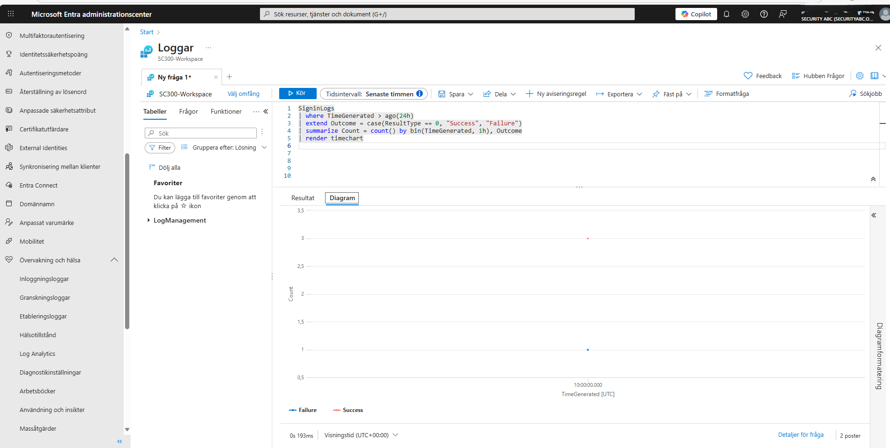
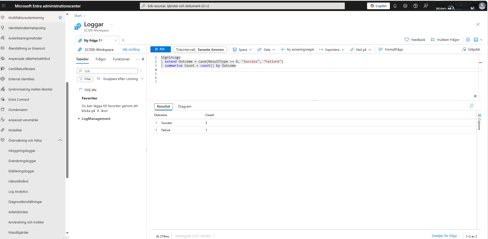
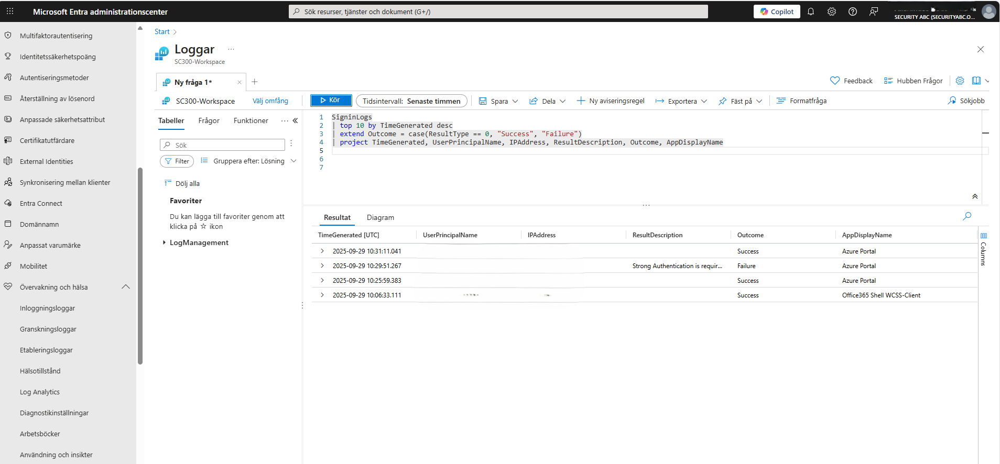
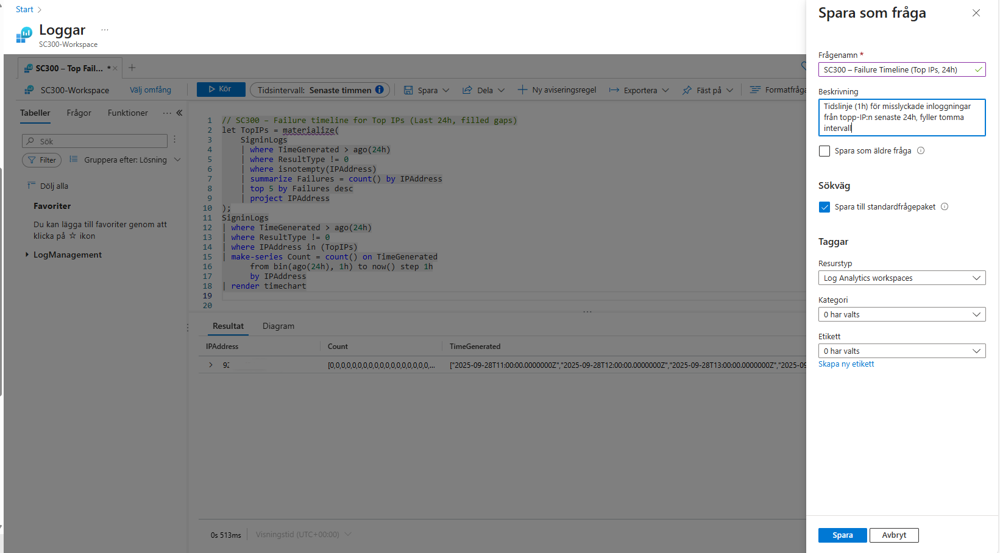

# Week 8 – Entra ID P2: Sign-in logs & Kusto (KQL)

This package contains a ready-to-publish folder for GitHub with:
- **README.md** (this file)
- **images/** (anonymized screenshots)
- **queries/** (KQL files you can paste into Log Analytics / Entra)

> **Privacy:** Screenshots are anonymized (no UPN/IP/tenant details). Screenshots do not contain EXIF GPS data; if you want to be extra careful, you can strip all EXIF locally before publishing, e.g. `exiftool -all= *.png`.

---

## 1) Recent sign-ins (table)

**KQL**
```kql
SigninLogs
| top 10 by TimeGenerated desc
| extend Outcome = case(ResultType == 0, "Success", "Failure")
| project TimeGenerated, UserPrincipalName, IPAddress, ResultDescription, Outcome, AppDisplayName
```

**Screenshot**  


---

## 2) Success vs Failure (counts)

**KQL**
```kql
SigninLogs
| where TimeGenerated > ago(24h)
| extend Outcome = case(ResultType == 0, "Success", "Failure")
| summarize Count = count() by Outcome
```

**Screenshot**  


---

## 3) Success vs Failure over time (last 24h, continuous)

**KQL**
```kql
SigninLogs
| where TimeGenerated > ago(24h)
| extend Outcome = case(ResultType == 0, "Success", "Failure")
| make-series Count = count() on TimeGenerated from ago(24h) to now() step 1h by Outcome
| render timechart
```

**Screenshot**  


---

## 4) Failures from top IPs (last 24h, timechart with filled gaps)

**KQL**
```kql
let TopIPs =
    materialize(
        SigninLogs
        | where TimeGenerated > ago(24h)
        | where ResultType != 0
        | where isnotempty(IPAddress)
        | summarize Failures = count() by IPAddress
        | top 5 by Failures desc
        | project IPAddress
    );
SigninLogs
| where TimeGenerated > ago(24h)
| where ResultType != 0
| where IPAddress in (TopIPs)
| make-series Count = count() on TimeGenerated from bin(ago(24h), 1h) to now() step 1h by IPAddress
| render timechart
```

**Screenshot**  


---

## KQL files

All queries are included in the **queries/** folder:

- `01_outcome_counts_last24h.kql`
- `02_outcome_timechart_last24h.kql`
- `03_top_users_timeline_last24h.kql`
- `04_failures_top_ips_timeline_filled_last24h.kql`

---

## Quick Git commands

```bash
git checkout -b week8-entra-kql
git add week8
git commit -m "Week8: Entra ID P2 KQL dashboards + anonymized screenshots"
git push -u origin week8-entra-kql
```
